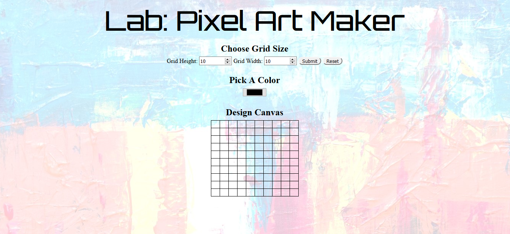

# Pixel Art Maker Project

## Table of Contents

* [Instructions](#instructions)
* [Preview](#preview)
* [Demo](#demo)

## Instructions

Follow the instructions as below:

    1. Type in the height and width of the grid.
    2. Click on Submit to draw the grid. 
    2. Choose a color.
    3. Click a cell in the grid to fill that cell with the chosen color.
    4. Clicking on reset will remove the grid

## Preview

## Demo

You can try it here:
https://emartsoft.github.io/alc-pixel-maker/
